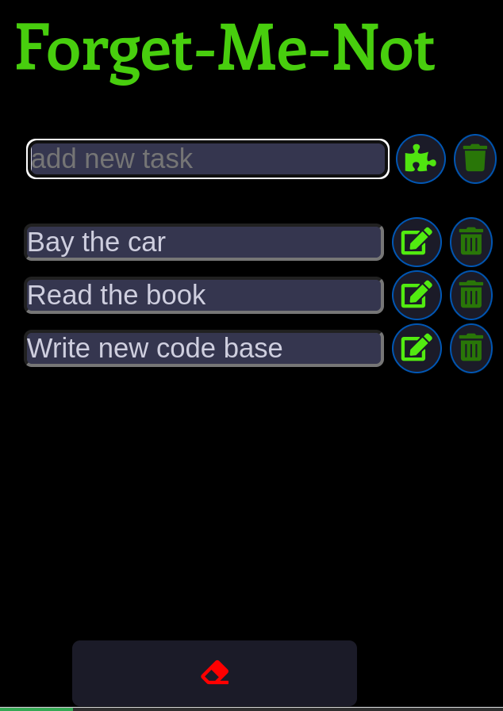

# TODO List

> A simple

## Table of contents

- [TODO List](#todo-list)
  - [Table of contents](#table-of-contents)
  - [General info](#general-info)
  - [Screenshots](#screenshots)
  - [Technologies](#technologies)
  - [Setup](#setup)
  - [Code Examples](#code-examples)
  - [Features](#features)
  - [Status](#status)

## General info

> The objective of the project is to practice separation of concern in
> JavaScript.

## Screenshots



## Technologies

- JavaScript
- HTML5
- CSS3
- VSC code

## Setup

clone the repo and start using the stop watch.

## Code Examples

```js
const createTask = (taskText) => {
	//create li
	const liEl = document.createElement('li');
	const inputEl = document.createElement('input');
	inputEl.id = 'userTaskInput';
	inputEl.value = taskText;
	liEl.appendChild(inputEl);

	// create button edit task
	const buttonEditTask = document.createElement('button');
	buttonEditTask.classList.add('edit-btn-task');
	buttonEditTask.innerHTML = '<i class="fas fa-edit"></i>';
	buttonEditTask.id = 'edit-task';
	buttonEditTask.addEventListener('click', (e) => {
		editTaskHandler(e);
	});

	// create button delete task
	const buttonDeleteTask = document.createElement('button');
	buttonDeleteTask.classList.add('delete-btn-task');
	buttonDeleteTask.innerHTML = '<i class="fas fa-trash-alt"></i>';
	buttonDeleteTask.id = 'remove-task';
	buttonDeleteTask.addEventListener('click', (e) => {
		deleteTaskHandler(e);
	});

	liEl.append(buttonEditTask, buttonDeleteTask);

	return liEl;
};
```

## Features

List of features ready and Todos for future development

-
-
-

To-do list:

-
-

## Status

Project is: _in progress_
